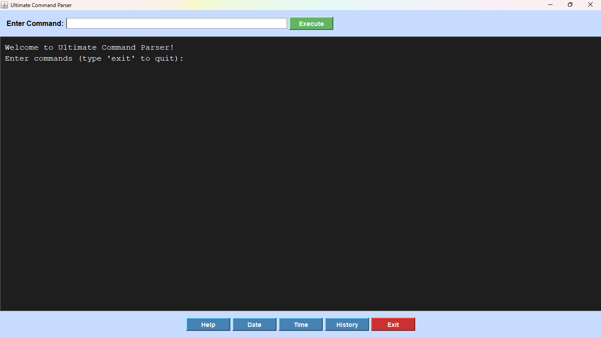

# Ultimate Command Parser  
A Java project that runs commands through **both GUI + CLI at the same time**.  
Built using Swing, OOP, Multithreading, and Collections.

---

## 🚀 What It Does  
- Takes input from GUI or Command Line  
- Executes commands instantly  
- Shows output in **both places**  
- Supports command history  
- Runs without freezing (multi-threaded)

---

## 🧩 Commands Supported  
- `help` → Show all commands  
- `echo <text>` → Print text  
- `reverse <text>` → Reverse text  
- `date` → Current date  
- `time` → Current time  
- `calc x op y` → Do maths  
- `history` → View past commands  
- `exit` → Close program  

---

## 🖥️ Tech Used  
Java • Swing • OOP • HashMap • ArrayList • Threads • Exception Handling

---

## 📂 Project Structure  
source/ → All Java source files
screenshots/ → Project demo images

---

## 🖼️ Screenshot  

---

## ▶️ Run the Project  
- cd source
- javac *.java
- java CommandParser

---

## 👤 Developer  
Ayush (BRUTEee)

